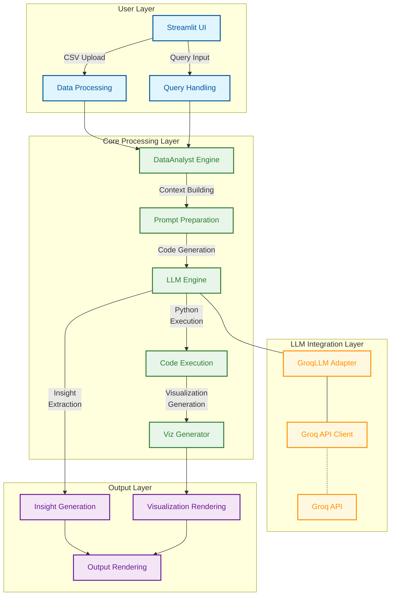
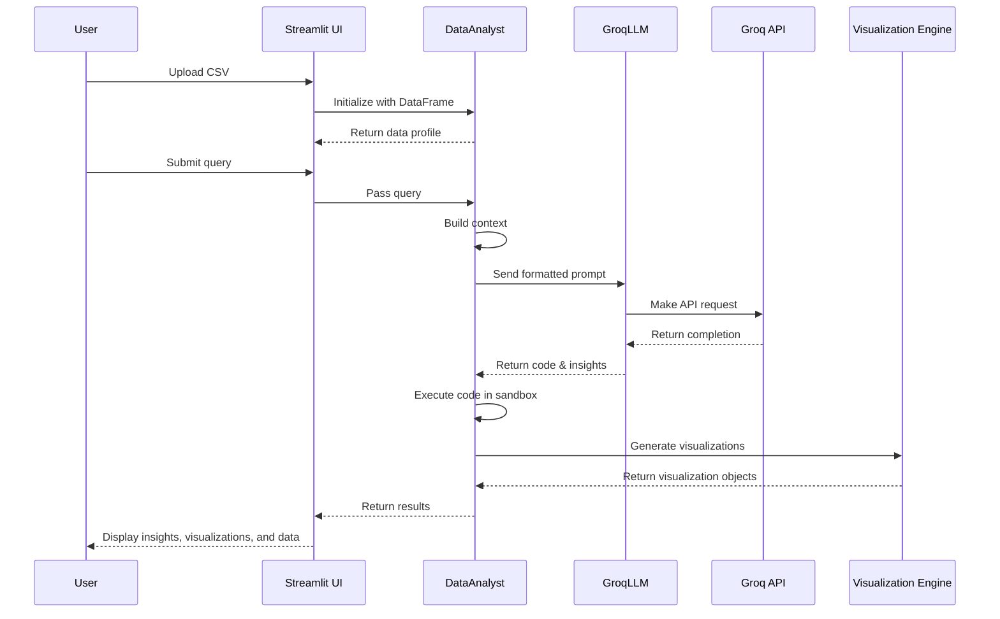
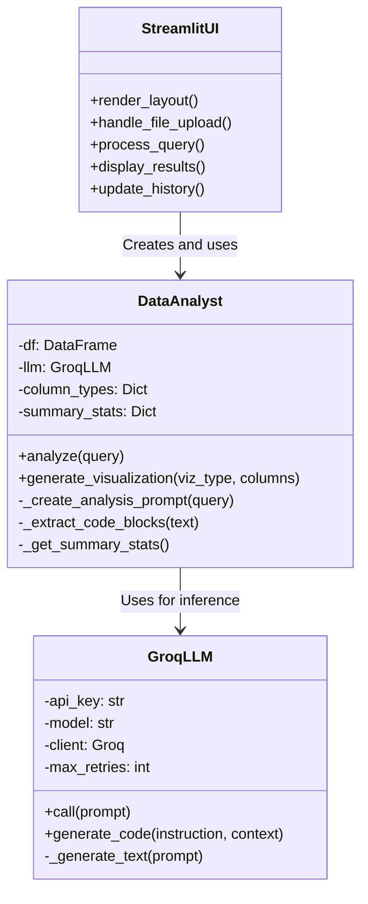
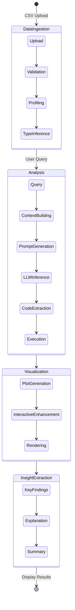

# AI Data Analyst

<div align="center">
  


<br/>
<strong>A Modern AI-Powered Data Analysis Platform</strong>

</div>

## 📊 Overview

The **AI Data Analyst** is a sophisticated, production-ready platform that democratizes data analysis through state-of-the-art Large Language Models (LLMs). By seamlessly integrating Groq's high-performance inference capabilities with robust data processing tools, the system enables anyone to interact with complex datasets through natural language.

Users can upload data, ask questions in plain English, and receive comprehensive insights with professional visualizations—all without writing a single line of code. The system dynamically generates contextually-appropriate visualizations, extracts meaningful patterns, and delivers clear explanations through an intuitive interface built with Streamlit.

## ✨ Key Features

<div align="center">
  <table>
    <tr>
      <td align="center"><b>🔍</b></td>
      <td><b>Conversational Data Analysis</b> - Interact with data using natural language queries</td>
    </tr>
    <tr>
      <td align="center"><b>📈</b></td>
      <td><b>Smart Visualization Selection</b> - Auto-generates optimal visualizations based on query intent and data types</td>
    </tr>
    <tr>
      <td align="center"><b>🧩</b></td>
      <td><b>Multi-Modal Results</b> - Presents findings through visualizations, explanations, and data tables</td>
    </tr>
    <tr>
      <td align="center"><b>⚡</b></td>
      <td><b>High-Performance Inference</b> - Uses Groq's optimized hardware for near real-time analysis</td>
    </tr>
    <tr>
      <td align="center"><b>🔄</b></td>
      <td><b>Interactive Exploration</b> - Refine queries and follow analytical threads in real-time</td>
    </tr>
    <tr>
      <td align="center"><b>📊</b></td>
      <td><b>Auto Data Profiling</b> - Generates statistical summaries and quality assessments automatically</td>
    </tr>
    <tr>
      <td align="center"><b>💾</b></td>
      <td><b>Analysis History</b> - Maintains session records for reproducibility and continued exploration</td>
    </tr>
    <tr>
      <td align="center"><b>🔌</b></td>
      <td><b>Flexible Model Selection</b> - Choose from various LLMs to balance performance and analysis depth</td>
    </tr>
  </table>
</div>

## 🏗️ Technical Architecture

### System Architecture Overview

The AI Data Analyst employs a layered architecture designed for flexibility, scalability, and extensibility:



### Data Flow & Processing Pipeline

The following diagram illustrates the end-to-end data flow and processing pipeline of the system:



### Component Architecture

The system consists of three primary component classes working together:



### Prompt Engineering

The system employs sophisticated prompt engineering to achieve optimal results:

1. **Context Building** - Dynamically includes relevant dataset information
2. **Progressive Disclosure** - Provides only necessary information to avoid token overflow
3. **Task Decomposition** - Breaks complex analysis into manageable sub-tasks
4. **Instruction Clarity** - Precise instructions for code generation and visualization creation

Example prompt template structure:

```
You are an expert data analyst. Analyze this dataset:

{dataset_summary}

Sample Data (first {sample_size} rows):
{sample_data}

Column Information:
{column_metadata}

User Query: "{user_query}"

Please provide:
1. A clear analysis answering the query
2. Python code to generate interactive visualizations
3. Key insights from the data

Guidelines:
- Use ```python and ``` for code blocks
- Use Plotly for interactive visualizations 
- Include proper plot labels, titles, and hover information
- Handle potential missing data
...
```

## 🛠️ Technical Stack

<div align="center">
<table>
  <tr>
    <th>Category</th>
    <th>Technology</th>
    <th>Version</th>
    <th>Purpose</th>
  </tr>
  <tr>
    <td rowspan="3"><b>Data Processing</b></td>
    <td>pandas</td>
    <td>2.0+</td>
    <td>Data manipulation and analysis</td>
  </tr>
  <tr>
    <td>numpy</td>
    <td>1.24+</td>
    <td>Numerical operations</td>
  </tr>
  <tr>
    <td>pandasai</td>
    <td>2.0+</td>
    <td>AI-powered DataFrame operations</td>
  </tr>
  <tr>
    <td rowspan="2"><b>LLM Integration</b></td>
    <td>groq</td>
    <td>0.4+</td>
    <td>Groq API client</td>
  </tr>
  <tr>
    <td>GroqLLM</td>
    <td>custom</td>
    <td>PandasAI-compatible LLM adapter</td>
  </tr>
  <tr>
    <td rowspan="3"><b>Visualization</b></td>
    <td>plotly</td>
    <td>5.0+</td>
    <td>Interactive visualizations</td>
  </tr>
  <tr>
    <td>matplotlib</td>
    <td>3.5+</td>
    <td>Static visualization foundation</td>
  </tr>
  <tr>
    <td>seaborn</td>
    <td>0.12+</td>
    <td>Statistical data visualization</td>
  </tr>
  <tr>
    <td rowspan="2"><b>Interface</b></td>
    <td>streamlit</td>
    <td>1.32+</td>
    <td>Web application framework</td>
  </tr>
  <tr>
    <td>streamlit.components.v1</td>
    <td>1.32+</td>
    <td>Custom UI components</td>
  </tr>
  <tr>
    <td rowspan="2"><b>Infrastructure</b></td>
    <td>python-dotenv</td>
    <td>1.0+</td>
    <td>Environment variable management</td>
  </tr>
  <tr>
    <td>pyyaml</td>
    <td>6.0+</td>
    <td>Configuration management</td>
  </tr>
</table>
</div>

### Basic Workflow

1. Access the web interface at http://localhost:8501
2. Upload your CSV dataset using the file uploader
3. Enter natural language queries about your data
4. View the generated visualizations, insights, and explanations

### Query Examples

The system can handle a wide range of analytical questions:

#### Exploratory Analysis
- "What are the basic statistics of this dataset?"
- "Show me the distribution of values in column X"
- "Visualize the relationship between variables X and Y"

#### Statistical Analysis
- "What's the correlation between customer age and purchase amount?"
- "Is there a statistically significant difference between groups A and B?"
- "What factors best predict the target variable?"

#### Business Intelligence
- "Show me sales trends by region over the last 6 months"
- "Which products have declining sales but high profit margins?"
- "Identify outliers in the transaction data and explain possible causes"

### Interactive Features

- **Analysis History**: Review and revisit previous analyses in your session
- **Custom Visualization Parameters**: Fine-tune generated visualizations
- **Data Transformation**: Apply common transformations through natural language
- **Export Options**: Save results as images, CSV, or full HTML reports

## 🧩 System Components

### Core Classes

#### GroqLLM

The `GroqLLM` class provides a specialized interface to Groq's API with enhanced reliability features:

```python
class GroqLLM(LLM):
    """
    Custom LLM implementation for Groq API integration.
    Extends the base LLM class from PandasAI to provide specific
    functionality for interacting with Groq's language models.
    """
    
    def __init__(self, api_key=None, model="llama-3.3-70b-versatile"):
        # Initialize with API key and model configuration
        
    def call(self, prompt):
        # Main method for making API calls with retry logic
        
    def generate_code(self, instruction, context=None):
        # Specialized method for code generation tasks
```

**Key Capabilities:**
- Exponential backoff retry mechanism for handling transient errors
- Automatic error recovery and graceful fallbacks
- Response validation to ensure quality outputs
- Streaming support for real-time feedback

#### DataAnalyst

The `DataAnalyst` class serves as the core analysis engine:

```python
class DataAnalyst:
    """
    AI-powered data analyst that processes dataframes and generates
    insights and visualizations based on natural language queries.
    """
    
    def __init__(self, df, model="llama3-70b-8192"):
        # Initialize with dataframe and model
        
    def analyze(self, query):
        # Main method for processing natural language queries
        
    def generate_visualization(self, viz_type, columns, title=None):
        # Create specific visualization types on demand
```

#### StreamlitOutput

The `StreamlitOutput` class manages the rendering of results in the UI:

```python
class StreamlitOutput:
    """
    Handler for rendering various types of outputs in the Streamlit UI.
    """
    
    def __init__(self, container):
        # Initialize with a Streamlit container
        
    def on_plot(self, plot):
        # Render visualization objects
        
    def on_dataframe(self, df):
        # Display data tables with interactive features
```

## 🔄 Process Flow

The system follows a well-defined process flow for each analysis task:



## 🌐 Possible Use Cases

### Business Intelligence

<div align="center">
<table>
  <tr>
    <th>Use Case</th>
    <th>Description</th>
    <th>Example Query</th>
  </tr>
  <tr>
    <td><b>Executive Dashboards</b></td>
    <td>Generate on-demand insights for C-suite decision makers</td>
    <td>"What were our top 5 performing products this quarter and why?"</td>
  </tr>
  <tr>
    <td><b>Sales Analysis</b></td>
    <td>Identify trends, seasonality, and customer segments</td>
    <td>"Show me sales trends by region for the past year with forecasting"</td>
  </tr>
  <tr>
    <td><b>Performance Monitoring</b></td>
    <td>Track KPIs and automatically highlight anomalies</td>
    <td>"Identify underperforming segments compared to our targets"</td>
  </tr>
  <tr>
    <td><b>Market Analysis</b></td>
    <td>Discover product affinity and cross-selling opportunities</td>
    <td>"Which products are frequently purchased together?"</td>
  </tr>
</table>
</div>

### Data Science

- **Exploratory Data Analysis**: Rapidly understand dataset characteristics
- **Feature Engineering**: Identify potential predictive variables
- **Hypothesis Testing**: Quickly validate or refute data hypotheses
- **Model Performance Analysis**: Analyze confusion matrices and performance metrics

### Domain-Specific Applications

- **Healthcare**: Patient outcome analysis and treatment efficacy comparisons
- **Finance**: Risk assessment, fraud detection pattern analysis
- **Retail**: Customer behavior analysis, inventory optimization
- **Manufacturing**: Quality control and process optimization

## 🧪 Testing and Validation

The system includes comprehensive testing:

- **Unit Tests**: Core components and individual functions
- **Integration Tests**: End-to-end workflows and component interaction
- **Performance Tests**: Benchmarking for response times and resource usage
- **Quality Assessment**: Evaluation of LLM response quality and accuracy

## 🔮 Future Roadmap

<div align="center">
<table>
  <tr>
    <th>Feature</th>
    <th>Description</th>
    <th>Timeline</th>
  </tr>
  <tr>
    <td><b>Multi-data Source Support</b></td>
    <td>Connect to databases, APIs, and other data sources</td>
    <td>Q3 2023</td>
  </tr>
  <tr>
    <td><b>Automated Report Generation</b></td>
    <td>Create PDF/PowerPoint reports with key insights</td>
    <td>Q4 2023</td>
  </tr>
  <tr>
    <td><b>Advanced Data Transformation</b></td>
    <td>Complex data preparation capabilities</td>
    <td>Q1 2024</td>
  </tr>
  <tr>
    <td><b>Collaborative Features</b></td>
    <td>Share analyses and insights with team members</td>
    <td>Q2 2024</td>
  </tr>
  <tr>
    <td><b>Local LLM Support</b></td>
    <td>Option to use local models for privacy-sensitive data</td>
    <td>Q3 2024</td>
  </tr>
</table>
</div>

## ⚠️ DISCLAIMER: FOR EDUCATIONAL PURPOSES ONLY

This AI Data Analyst platform is provided **strictly for educational and research purposes**. Users should be aware of the following important considerations:

- The platform is designed as a learning tool to demonstrate the integration of AI, data analysis, and visualization technologies.
- Results, analyses, and visualizations generated by this system should not be used for making critical business decisions, financial investments, medical diagnoses, or other high-stakes applications without proper verification.
- The system does not guarantee the accuracy, completeness, or reliability of any outputs, as they are dependent on the quality of input data and the limitations of underlying models.
- No warranty is provided regarding the suitability of this system for any particular purpose beyond education and learning.
- Users are responsible for ensuring their use of this system complies with applicable laws, regulations, and ethical guidelines, particularly concerning data privacy and intellectual property.
- The developers and contributors assume no liability for any consequences arising from the use or misuse of this platform or its outputs.

By using this system, you acknowledge that you understand its educational nature and accept these limitations.

**For production applications, professional data analysis solutions with appropriate validation, security, and support should be used.**

## 📝 License

Distributed under the MIT License. See [LICENSE](LICENSE) for more information.

## 🙏 Acknowledgements

- Groq for providing high-performance LLM inference
- Streamlit team for the intuitive application framework
- PandasAI for pioneering the integration of AI with data analysis
- The open-source community for all supporting libraries

## 📧 Contact

Project Maintainer - [your-email@example.com](mailto:your-email@example.com)

Project Link: [https://github.com/yourusername/ai-data-analyst](https://github.com/yourusername/ai-data-analyst) 
